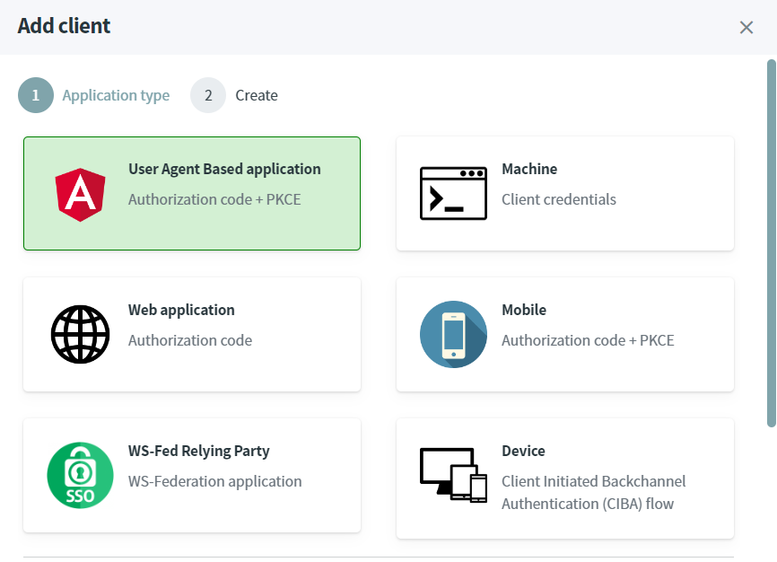
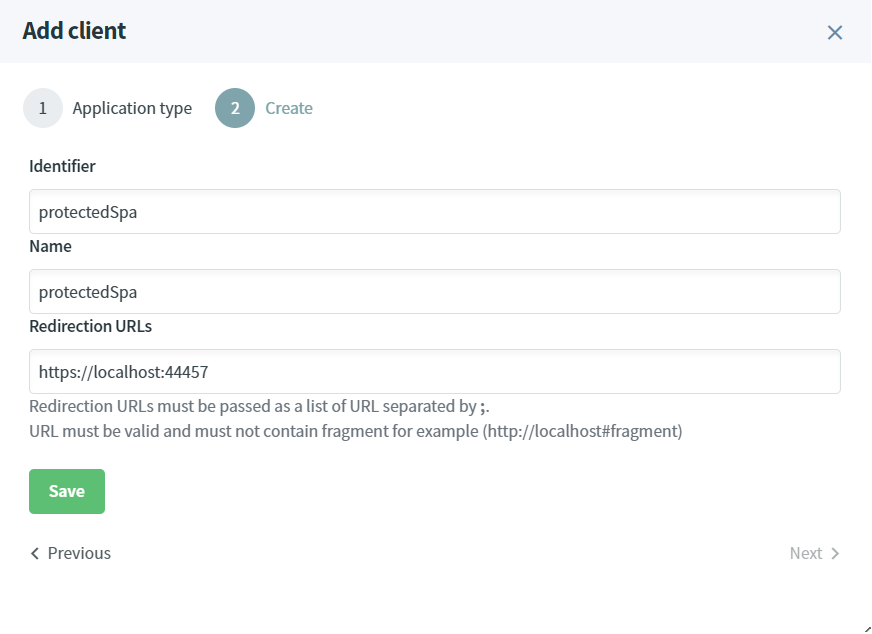

# Protect Single-Page Application (SPA) using Angular

Single Page Application (SPA) must use **authorization code** grant-type with **PKCE** client authentication method.

> [!WARNING]
> Before you start, Make sure you have an [up and running IdentityServer and IdentityServer website](/documentation/gettingstarted/index.html).

## Source Code

The source code of this project can be found [here](https://github.com/simpleidserver/SimpleIdServer/tree/master/samples/ProjectSPA).

## Add a client

The first step consists to configure the OPENID client.

* Open the IdentityServer website [http://localhost:5002](http://localhost:5002).
* In the Clients screen, click on `Add client` button.
* Select `User Agent Base application` and click on next.



* Fill-in the form like this and click on the `Save` button to confirm the creation.



## Create angular application

The last step consists to create and configure an angular project.

* Open a command prompt, run the following commands to create the directory structure for the solution.

```
mkdir ProjectSPA
cd ProjectSPA
mkdir src
dotnet new sln -n ProjectSPA
```

* Create a web project named `Website` and install the `angular-oauth2-oidc` npm package.

```
cd src
dotnet new angular -n Website
cd Website\ClientApp
npm i angular-oauth2-oidc@14.0.1 --save
```

* Add the `Website` project into your Visual Studio solution.

```
cd ..\..\..
dotnet sln add ./src/Website/Website.csproj
```

* Edit the file `ClientApp\src\app\app.module.ts` and import the `OAuthModule` module.

```
@NgModule({
  declarations: [],
  imports: [
    OAuthModule.forRoot()
  ],
  providers: [],
  bootstrap: []
})
export class AppModule { }
```

* Create an `auth-config.ts` file in the directory `ClientApp\src\app`, and copy the following code. The file contains the authentication settings like URL of the Identity Provider and the client identifier.

```
import { AuthConfig } from 'angular-oauth2-oidc';

export const authCodeFlowConfig: AuthConfig = {
  issuer: 'https://localhost:5001/master',
  redirectUri: window.location.origin,
  clientId: 'protectedSpa',
  responseType: 'code',
  scope: 'openid profile',
  showDebugInformation: true,
};
```

* Edit the `ClientApp\src\app\nav-menu\nav-menu.component.ts` file, import the `authCodeFlowConfig` JSON object, inject the `OAuthService` into the constructor and add a `login` procedure. This procedure will be called to initiate the authentication workflow.

```
import { OAuthService } from 'angular-oauth2-oidc';
import { authCodeFlowConfig } from '../auth-config';

@Component({
  selector: 'app-nav-menu',
  templateUrl: './nav-menu.component.html',
  styleUrls: ['./nav-menu.component.css']
})
export class NavMenuComponent {  
  isConnected: boolean = false;
  name: string = "";

  constructor(private oauthService: OAuthService) {
    this.oauthService.configure(authCodeFlowConfig);
    this.oauthService.loadDiscoveryDocumentAndTryLogin();
    var claims: any = this.oauthService.getIdentityClaims();
    if (!claims) {
      return;
    }

    this.isConnected = true;
    this.name = claims["sub"];
  }

  login(evt: any) {
    evt.preventDefault();
    this.oauthService.initImplicitFlow();
  }
}
```

* Edit the `ClientApp\src\app\nav-menu\nav-menu.component.html` file and add a login button.

```
<li class="nav-item" *ngIf="!isConnected">
  <a class="nav-link text-dark" (click)="login($event)">Authenticate</a>
</li>
<li class="nav-item" *ngIf="isConnected">
  <a class="nav-link text-dark">Welcome {{name}}</a>
</li>
```

* In a command prompt, navigate to the `src\Website` directory and launch the project.

```
dotnet run --urls=http://localhost:4200
```

* Navigate to the website [http://localhost:4200](http://localhost:4200) and authenticate with the login : `administrator` and password : `password`.